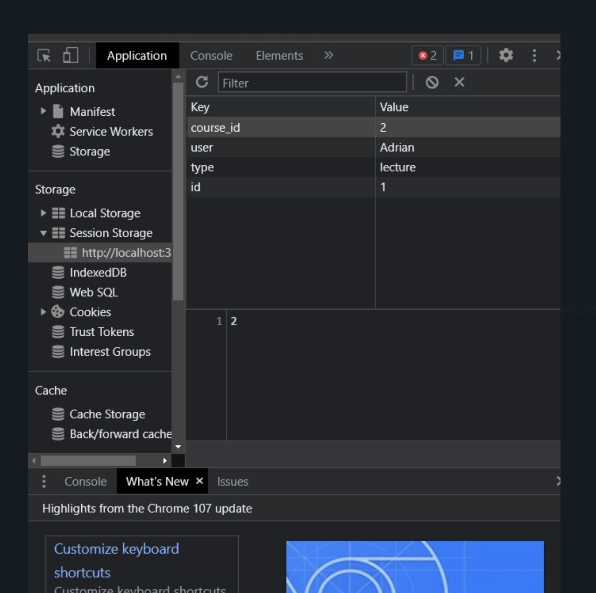

### Run django server with:
```
python manage.py runserver
```

### Run frontend with: 
```
cd ./frontend
npm run dev
```

### Pages:
- /action
- /signup
- /signin
- /faceid
- /home

### To display stuff on the home and action pages:
- Since we cannot actually login, you need to make your own session id in the browser like this:

